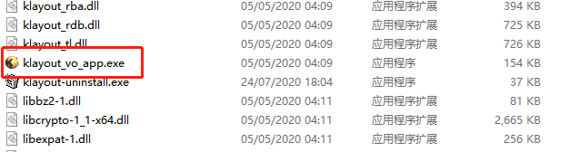
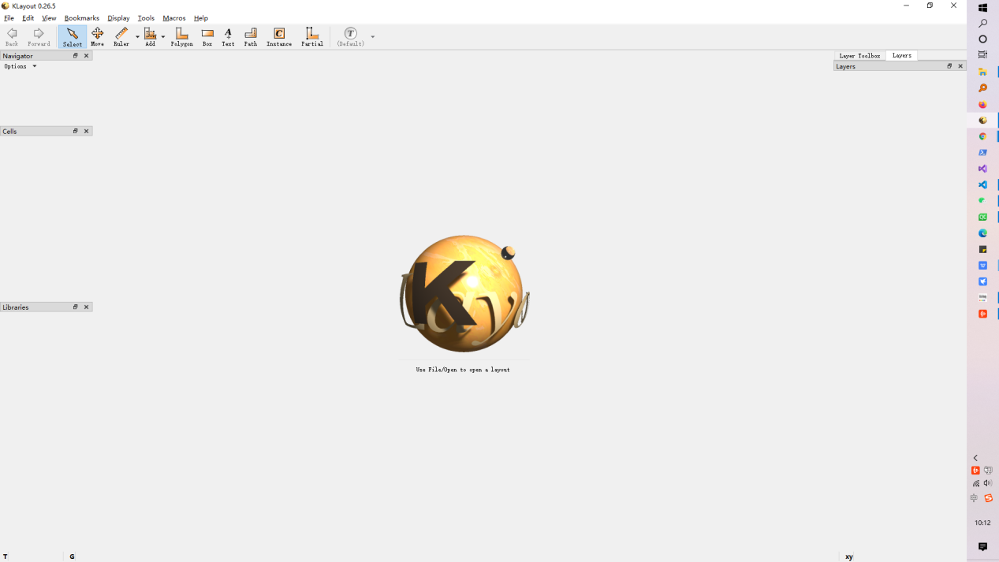
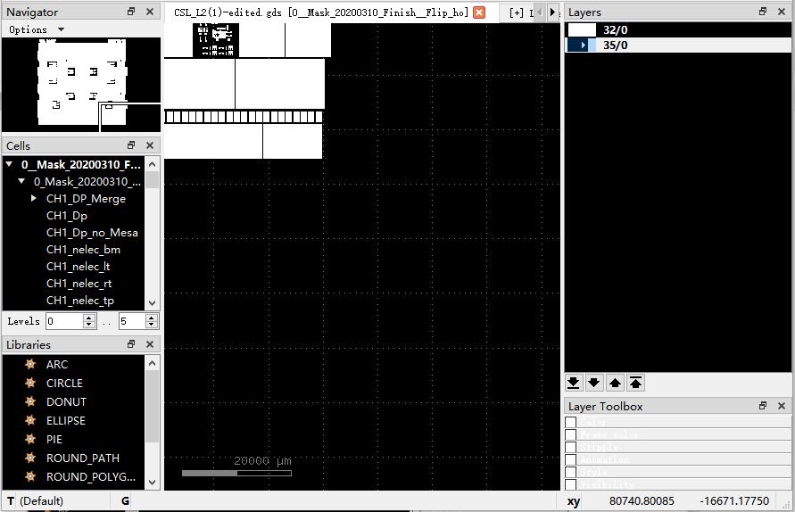
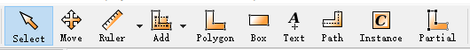
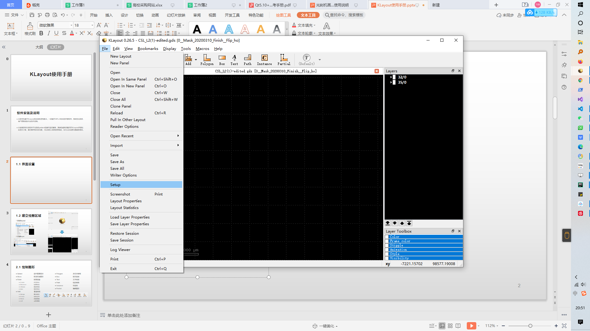
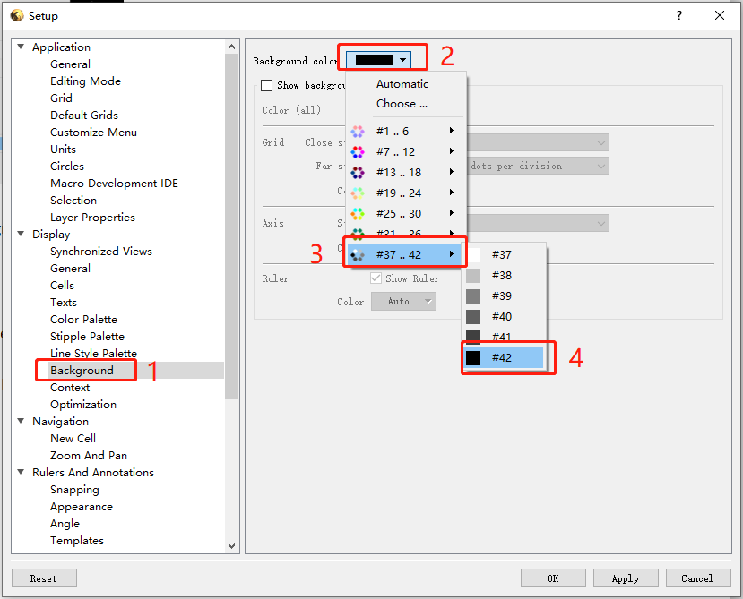
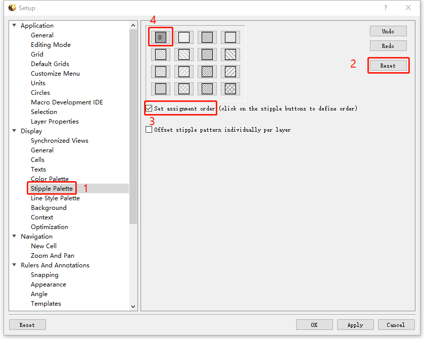
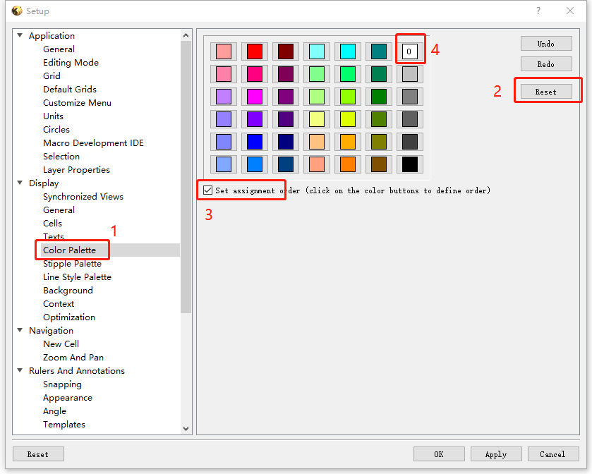
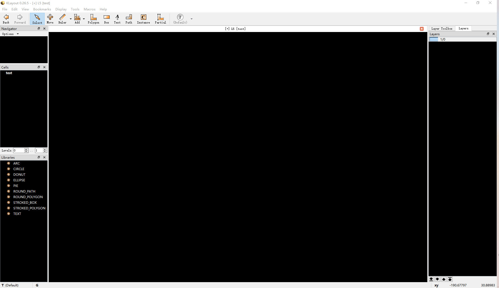

二、安装说明及界面初始设置
====================================

本软件经过二次开发后，解压即可使用。

2. 软件界面
-----------------------  
1) 开始界面
+++++++++++++++++++++

2) 编辑界面
+++++++++++++++++++++

软件界面依据方位分为上下左右四个部分，有不同的功能和内容，上、下及左边部分包括了所有的工具栏，中间黑色窗体展示了整个绘图界面，右边部分包含了图层、画笔等信息，可以对其属性进行编辑；以及命令行，辅助绘制。具体功能会在后面的章节给予相应的介绍。

3) 主要工具栏
+++++++++++++++++++++

* Select-选择所需图形
* Move-移动图形
* Ruler-尺寸测量
* Add-图形拼接，削减
* Polygon-多边形
* Box-矩形
* Text-文字绘制
* Path-路径绘制
* Instance-以cell为单位操作，阵列，旋转cell等等
* Partial-快速编辑图形大小

3. 配置
-----------------------  
由于光刻机需要使用特定格式的图片，所以在软件中需要进行一定的设置以确保设计图案与工作图片相一致

动态演示
+++++++++++++++++++++
.. image:: 2-0.gif

分步设置
+++++++++++++++++++++
1) 点击File->setup
+++++++++++++++++++++

2) 点击Background，依照顺序点击，设置画布背景为黑色
+++++++++++++++++++++++++++++++++++++++++++++++++++++++++++++++

3) 点击Stipple Palette，依次点击，设置填充图案为实心
+++++++++++++++++++++++++++++++++++++++++++++++++++++++++++++++

4) 点击Color Palette，按图点击，设置填充颜色为白色
+++++++++++++++++++++++++++++++++++++++++++++++++++++++++++++++

5) 基础配置完成，配置一次即可，下次打开无需再次更改
+++++++++++++++++++++++++++++++++++++++++++++++++++++++++++++++

