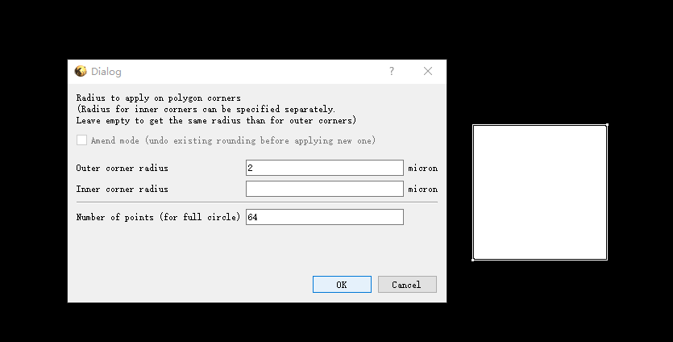

三、基本操作
=================
按照二中的步骤设置好操作后即可开始pattern的绘制：

1.新建layout
+++++++++++++++++++++++++
点击File->New Layout，

参数介绍
+++++++++++++++++++++++++
* Technology ：是一种用于特定工艺的一套模板，根据自身需求对参数进行高级自定义，通常使用时默认即可
* Top cell ：为当前布局的第一个cell，需要命名，名字便于管理即可
* Database unit ：默认为1nm，坐标单位是微米，所以查看坐标时最多精确到小数点后五位且仅作为显示用，实际绘制只能到1微米大小
* Initial window size：为中间编辑区域初次显示的大小，1微米即为1微米*1微米的大小，此选项不影响后续操作，默认即可
* Create layout in current panel ：勾选后会在当前panel再创建一个layout，一般在某些特定，默认不填

2.	新建layer
++++++++++++++++++
点击Edit-> Layer->New Layer创建新图层

.. image:: 3-2.png

Layer可以按照1,2,3...的顺序向下标定，
Datatype也可以根据实际需要设定，通常用于EBL，不影响具体图层属性，保持默认即可。给Layer命名，名字便于管理即可。

.. sidebar:: Layer Toolbox

    .. image:: 3-4.png

点击编辑界面右下角Layer Toolbox快捷栏中的Style，点击0px，设定边框宽度为无宽度，否则导出的pattern会被边线宽度影响

3.	绘制图形
++++++++++++++++++
.. Warning:: 绘制图形前先选择图层，由于不存在默认图层，所以绘制时需要选中所用图层，即使只有一张图层的情况下

            .. image:: 3-5.png

            否则会得到如下提示：

            .. image:: 3-6.png
    

3.1 绘制矩形
++++++++++++++++++++
点击工具栏box按钮绘制

.. image:: 3-1.gif

双击绘制好的矩形弹出属性，更改左下或右上的坐标即可做出相应改动：

3.2 绘制多边形
++++++++++++++++++++
点击工具栏polygon按钮绘制，双击绘制好的多边形弹出属性，更改坐标集中的坐标即可做出相应改动

3.3 绘制圆形
+++++++++++++++++++++
先绘制一个相同直径的正方形，点击edit->Selection->Round Corners

在Outer corner radius填入正方形的长度，Inner corner radius 可不填，Number of points为组成圆的多边形的顶点数，没有特殊要求保持默认，顶点数过多会增加内存负担，点击OK即可绘制一个接近圆的多边形，图中圆形由六十四边形构成，可以在对话框中修改多边形多边形的边数:sup:`注1`

.. note:: 虽然多边形边越多越接近圆形，但由于导出为图片依旧是用独立的像素去表示圆形，所以添加更多点提升的效果比较有限，默认64一般已经足够，并且更多的点会占用更多的内存空间，导致程序卡死，所以在绘制大尺寸的时候建议控制在一定的范围内。
     
     .. image:: 3-11.png

3.4 绘制路径
+++++++++++++++++++++
点击工具栏path按钮绘制，设定路径宽度

双击绘制好的多边形弹出属性，更改坐标集中的坐标及宽度即可做出相应改动。

.. image:: 3-13.png

路径提供了四种样式，下列三种分别是Flush，Square和Round，可以比较出三者的区别，还有一种是Variable，可分别设置路径两端的类型

3.5 Partial-图像编辑
++++++++++++++++++++++++++++++
Partial 功能主要是根据顶点改变已有图形的形状，原有图形会根据新的顶点坐标生成一个新的多边形。

4 图形绘制方式
-------------------------------
4.1 Add菜单
+++++++++++++++++++++
此项菜单中的选项直接决定绘制的图案将以何种方式影响当前图案，菜单包括，add, Merge,Erase,Mask,Diff

* Add: 添加，也就是最经常使用的功能，每一个图形都以独立的方式展现，上一节的内容都是在add模式下演示
* Merge: 融合，当一个新图形重叠在另一个上时会融合为一个图形，比如两个矩形重叠，那么就会形成一个包含两个矩形所有范围的多边形
* Erase: 擦除，任何重叠的部分会被清除，新图形不会被保留。
* Mask: 只保留重叠部分
* Diff: 保留非重叠部分

