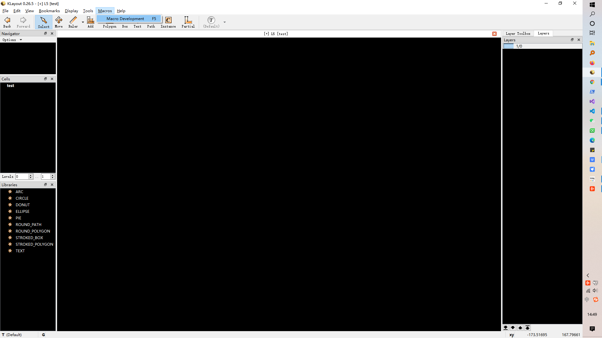
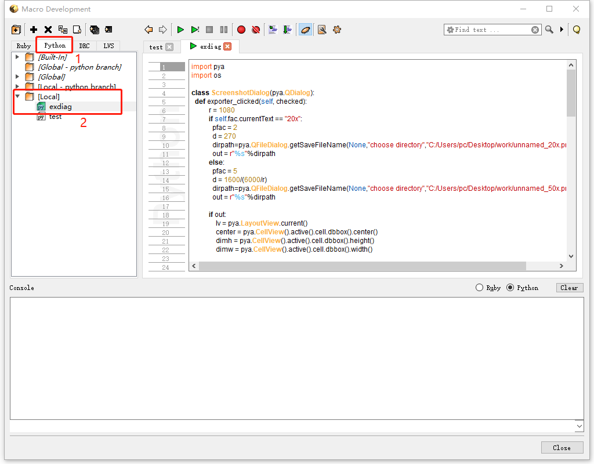
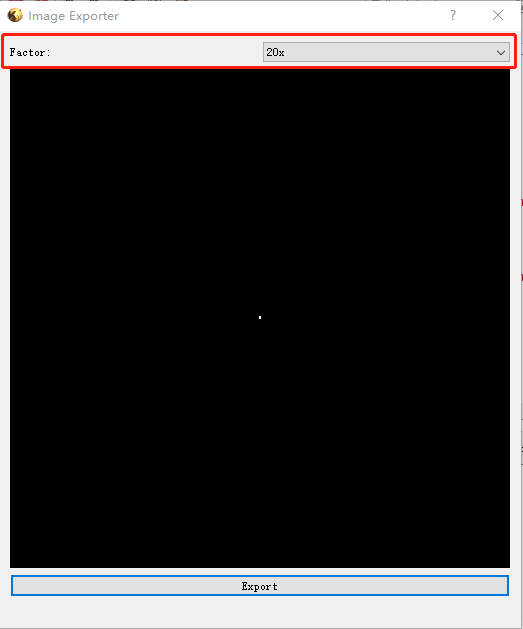
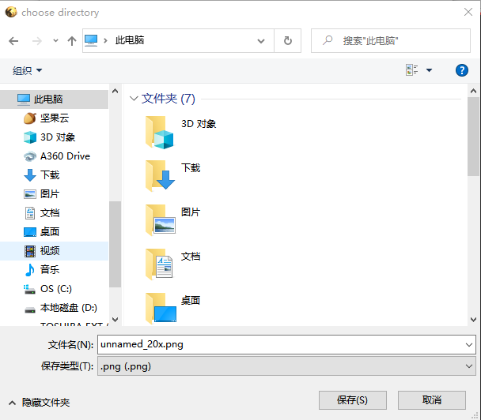
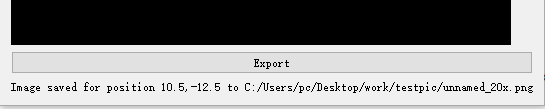

四、图片导出
=================
.. Caution:: 导出之前，先将View->Show Grid取消选中，否则网格也会在图片中被导出

    .. image:: 4-0.png    
    确保外框线宽为0PX（可查看新建layer的设置）   

4.1 单图导出
-----------------
1. 点击Macros->Macro Development，或者在KLayout中按F5，唤出脚本页面。

2. 选中Python选项卡，打开Local中的exdiag脚本，单击绿色箭头或按F5执行脚本

3. 选择使用的是哪种倍数的物镜.. sup:: 注1

4. 单击Export，确认保存地址

5. 成功后窗口底部会显示消息

4.2大图切分导出
-----------------
大图切分是为了做大尺寸图形所定制开发的功能，比如一张实际6mm*6mm的大图，对于需要精确到1微米的光刻机，单张图片的像素数是非常大的，这是我们就需要将图片切割，以光刻机可以读取的大小，通过与高精度电动位移台的配合，将单张图片精准的拼接到对应位置上，这样就可以将一张大图以分步的形式曝光出来。

模仿上面单图导出的操作，打开Local/exdiag-advanced脚本.. image:: 4-6.png

参数设置：
* 设置分辨率，默认为9720
* 设置物镜参数
* 设置边界，默认为10
* 可选择单图导出或分割导出，默认分割，点击Export即可导出。

.. sidebar:: Image Exporter
    .. image:: 4-7.png

点击确定后会开始导图流程

.. important:: 注意，图像根据计算导出的数量有时会很大，时间相应比较长，一旦整个过程中断，无法从中断的地方重新开始，只能从头再来，请合理安排时间，导图过程中可以切换至后台。如果需要导出非常巨大的数量可联系我们的工程师协助。

.. important:: 注意编号为光刻机专用，请勿随意改动，否则会影响光刻机读取。

.. note:: 光刻机使用的图案根据不同倍数的物镜会有不同的要求，在20x下实际尺寸1微米用两个像素表示，50x下实际尺寸1微米用五个像素表示（例：一个5μm*5μm的pattern在20倍下需要10*10个像素，50倍下需要25*25像素）
 
导出结果 .. image:: 4-8.png