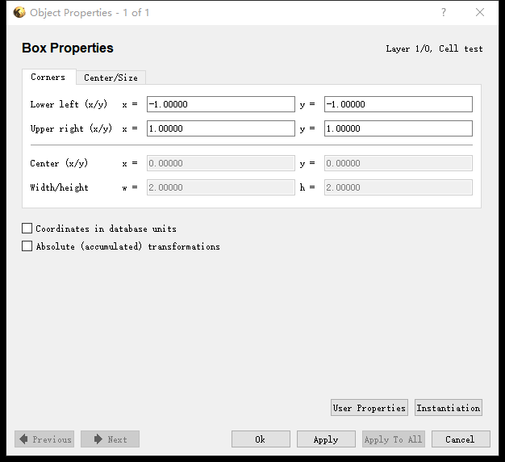
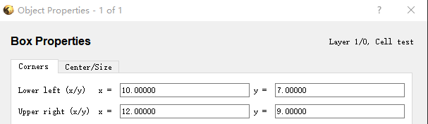
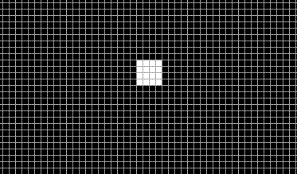
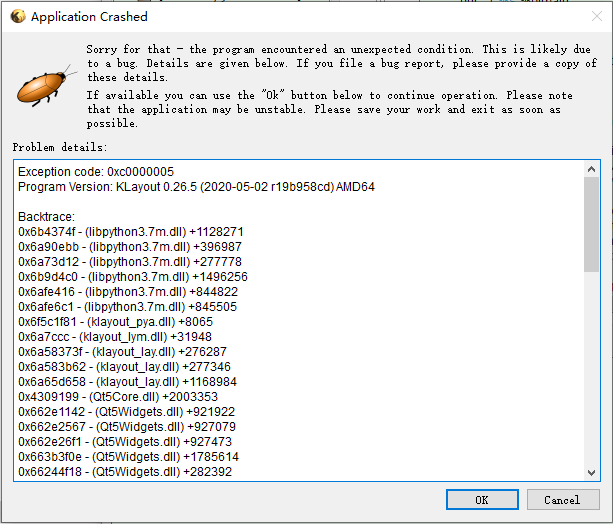

五、异常处理
=========================
#. 　图片导出问题
因为函数设置参数的问题，在有些特定情况下的图片导出会有非常有限的像素的缺失。在测试环境下，由于坐标系的影响，当图像跨过x，y轴时因为坐标轴的占用会导致这个方向的像素缺失，如果遇到这种情况，将图案往远离坐标轴的方向移动一定距离，直至脱离坐标轴即可。因为像素数对光刻图案最终尺寸有直接影响，故特此说明，实际情况下，按照一般光刻流程不会受到影响。

例：同样2*2的矩形，在20x物镜下，一个位于两个坐标轴上，一个位于第一象限内，导出时位于坐标轴上的矩形在x,y方向都有一个像素的缺失

#. 程序崩溃
在极小情况下，程序会遇到报错的情况，点击cancel会将程序直接关闭。如果有正在编辑的文件，推荐点击OK，此时程序会冻结但仍可以进行保存操作，正常保存文件，重启程序即可。

