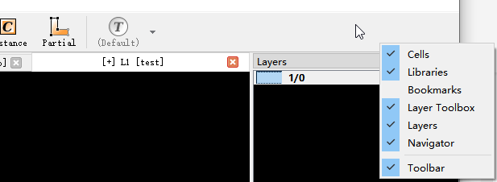
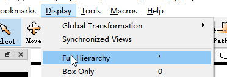

六、FAQ&How to
===============
Q：我找不到Layer 和Layer toolbox在哪里？

A:  右击工具栏空白处，勾选对应功能即可显示

Q：我的文件打开后不对，只有一个白块，看不到细节，怎么办？

A： 处于内存保护机制，一旦文件内容超过一定限制，就会隐藏一部分cell的细节，如果希望查看所有细节，点击菜单栏Display->Full Hierarchy就可以放开全部内容

Q：我导出的图片像素数不对，应该怎么办？

A：首先请检查图形大小和使用物镜在导出图片中的参数设置是否正确，其次请检查边框宽度是否设置为零（上面有具体操作步骤），最后查看是否遇到使用手册异常处理小节第一个问题。如果仍然无法解决，请联系我们工程师提供进一步协助。

Q:软件里的坐标和真实的尺寸是如何对应的？

A: 软件中有两套坐标体系，用户只需要用到左下角的坐标即可， 
1μm一个单位，比如10μm*10μm的正方形，坐标可以为（0,0）,（10,10）。需要注意的是左下角显示有小数点后五个单位，但实际操作中坐标仅精确到1微米。

Q: 软件里有许多设置，我应该如何操作？

A: Klayout是开源软件，本身在设置上有较大的自由性。为了方便配合我们的光刻机，优化了许多设置，简化了许多操作，尽可能让用户以最简便的方式上手使用光刻机。基于此，仅在图形绘制上放开了自由度，其他设置请尽可能按照默认或我们文档中的设置，否则会对使用光刻机产生一定的影响。如果有任何想法，可以联系我们的工程师，提供进一步的协助。
